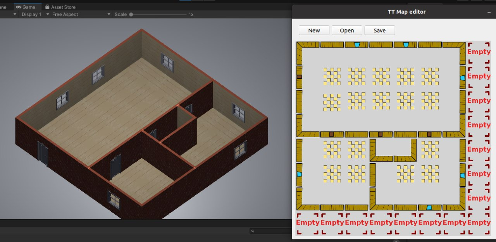

# TtMapEditor
Map editor for Unity 2.5D game

# Status
Only house editor is implemented.

Warning: Project is not finished. Interfaces and file format can be changed in the future.

# Map example


## Installation

To install and use **TtMapEditor**, follow these steps:

1. Clone the repository:

    ```bash
    git clone https://github.com/vitperov/TtMapEditor.git
    cd TtMapEditor
    ```

2. Install the required dependencies:

    ```bash
    pip install -r requirements.txt
    ```


